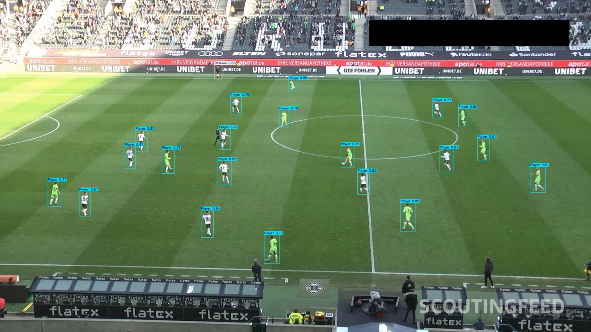
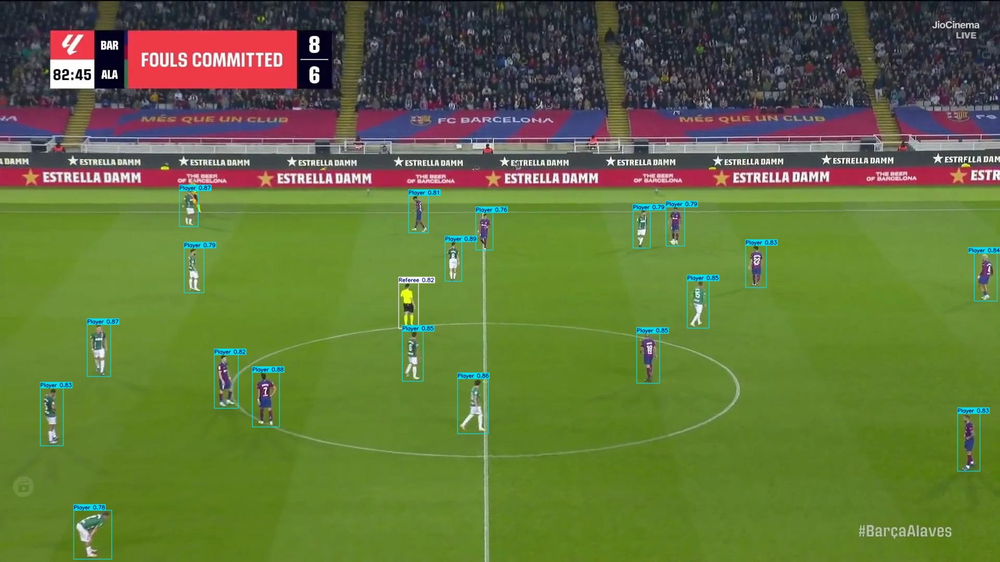

# ⚽ Football Detection Inference (YOLOv8)

This project performs football player and ball detection on images and videos using [YOLOv8](https://github.com/ultralytics/ultralytics). The model was trained on custom data and used here for **inference only**, with outputs featuring thin bounding boxes and clean annotations for better visuals and presentations.

---



## 📌 Features

- 🔍 Inference on both images and videos
- ✅ Supports Python script and YOLO CLI
- 📦 Pre-trained model (`best.pt`) usage
- 🖼️ Clean output with minimal styling
- 💾 Save annotated images/videos to Google Drive

---

## 🛠️ Setup

### 🐍 Python Libraries

Install required dependencies:

```bash
pip install ultralytics opencv-python matplotlib

Make sure your YOLOv8 best.pt weights are saved in:
/content/drive/MyDrive/ObjectDetection/FootballPlayerDetection/TrainingResult/FootballDetection2/weights/best.pt

# python inference_images.py
This script will:

Load test images from:
/content/drive/MyDrive/ObjectDetection/FootballPlayerDetection/Dataset/test/images

Annotate images using YOLOv8

Save results as:
/content/drive/MyDrive/ObjectDetection/FootballPlayerDetection/DetectionResults/output_.jpg, etc.

# python inference_video.py
This script will:

Load a test video from:
/content/drive/MyDrive/ObjectDetection/FootballPlayerDetection/TestVideos/test.mp4

Run frame-by-frame prediction

Save output as:
/content/drive/MyDrive/ObjectDetection/FootballPlayerDetection/DetectionResults/pretty_output.mp4

Credits
YOLOv8 by Ultralytics

Dataset: Custom labeled football match frames

Author: Md. Maruf

📄 License
This project is licensed under the MIT License. You are free to use, modify, and distribute the code with attribution.

